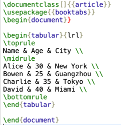
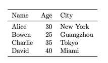

## Markdown Exporter

**Author:** [bowenliang123](https://github.com/bowenliang123)

**Github Repo:** https://github.com/bowenliang123/md_exporter

### Description

This Dify plugin `md_exporter` provides tools to export Markdown text to DOCX, PPTX, XLSX, PDF, HTML, MD, CSV, JSON, XML, LaTex, RST files, and extract code blocks to snippet files as `.py` file, `.sh` file, and etc.

<table>
  <tr>
    <th>Tool</th>
    <th>Input (Syntax)</th>
    <th>Output</th>
  </tr>
  <tr>
    <td><code>md_to_docx</code></td>
    <td rowspan="6">
      <a href="https://daringfireball.net/projects/markdown/syntax">Markdown text</a>
    </td>
    <td>Word file (.docx)</td>
  </tr>
  <tr>
    <td><code>md_to_html</code></td>
    <td>HTML file (.html)</td>
  </tr>
  <tr>
    <td><code>md_to_pdf</code></td>
    <td>PDF file (.pdf)</td>
  </tr>
  <tr>
    <td><code>md_to_md</code></td>
    <td>Markdown file (.md)</td>
  </tr>
  <tr>
    <td><code>md_to_xml</code></td>
    <td>XML file (.xml)</td>
  </tr>
  <tr>
    <td><code>md_to_rst</code></td>
    <td>
      <p>reStructuredText file (.rst)</p>
      [with basic syntax support]
    </td>
  </tr>
  <tr>
    <td><code>md_to_pptx</code></td>
    <td>
      <a href="https://github.com/MartinPacker/md2pptx/blob/master/docs/user-guide.md#creating-slides">
        Markdown slides in md2pptx dialect
      </a>
    </td>
    <td>PowerPoint file (.pptx)</td>
  </tr>
  <tr>
    <td><code>md_to_codeblock</code></td>
    <td>
      <a href="https://www.markdownguide.org/extended-syntax/#fenced-code-blocks">
        Markdown Code Blocks
      </a>
eg.
<pre>
```python
print("Hello Dify!")
```</pre>
    </td>
    <td>
      Generated files by language type of the code blocks:
      <ul>
          <li>python → .py file</li>
          <li>javascript → .js file</li>
          <li>html → .html file</li>
          <li>bash → .sh file</li>
          <li>json → .json file</li>
          <li>xml → .xml file</li>
          <li>svg → .svg file</li>
          <li>css → .css file</li>
          <li>markdown → .md file</li>
      </ul>
    </td>
  </tr>
  <tr>
    <td><code>md_to_xlsx</code></td>
    <td><a href="https://www.markdownguide.org/extended-syntax/#tables">Markdown tables</a></td>
    <td>Excel file (.xlsx)</td>
  </tr>
  <tr>
    <td><code>md_to_csv</code></td>
    <td rowspan="4">
      <a href="https://www.markdownguide.org/extended-syntax/#tables">Single Markdown table</a>
  </td>
    <td>CSV file (.csv)</td>
  </tr>
  <tr>
    <td><code>md_to_json</code></td>
    <td>JSON file (.json)</td>
  </tr>
  <tr>
    <td><code>md_to_latex</code></td>
    <td>LaTeX file (.tex)</td>
  </tr>
</table>

The transformation processes for each file format are as followed:

- Docx file: Markdown > HTML -> Docx file
- HTML file: Markdown -> HTML file
- PDF file: Markdown -> HTML -> PDF file
- md file: Markdown -> md file
- XML file: Markdown -> HTML -> XML file
- RST file: Markdown -> RST file
- PPTX file: Markdown -> PPTX file
- XLSX file: Markdown -> HTML -> Pandas DataFrame -> XLSX file
- CSV file: Markdown -> HTML -> Pandas DataFrame -> CSV file
- JSON file: Markdown -> HTML -> Pandas DataFrame -> JSON file
- LaTeX file: Markdown -> HTML -> Pandas DataFrame -> LaTeX file
- Code Blocks: Markdown -> Code Blocks with language type and content -> Varying files formats by language type

## Tools

- `md_to_docx` Tool

  Input Markdown text:

```
# English
The Moon is a celestial body that orbits the Earth, with a diameter of about 3,474 kilometers.

# 月球
月球是一个围绕地球运行的星球，直径约为3474公里。

# 繁体中文
月球是一個圍繞地球運行的星球，直徑約為3474公里。

# 日本語
月は地球の周りを回る天体で、直径は約3474キロメートルです。

# Português
A Lua é um corpo celeste que orbita a Terra, com um diâmetro de cerca de 3.474 quilômetros.
```

usage:


output DOCX file:


- `md_to_html` Tool

output HTML file:


- `md_to_pdf` Tool

- output PDF file:


- `md_to_pptx` Tool

Input Markdown text
in [md2pptx's Markdown slides syntax](https://github.com/MartinPacker/md2pptx/blob/master/docs/user-guide.md#creating-slides):

```
# This Is A Presentation Title Page

## This Is A Presentation Section Page

### This Is A Bulleted List Page

* One
    * One A
    * One B
* Two
```

output PPTX file:


- `md_to_rst` Tool

- `md_to_xlsx` Tool

Input Markdown text:

```
| Name    | Age | City        |
|---------|-----|-------------|
| Alice   | 30  | New York    |
| Bowen   | 25  | Guangzhou   |
| Charlie | 35  | Tokyo       |
| David   | 40  | Miami       |
```

usage:


output XLSX file:


- `md_to_csv` Tool

- `md_to_json` Tool

output JSON file:


- `md_to_xml` Tool

output XML file:


- `md_to_latex` Tool

output LaTex file:



Viewed as PDF:



- `md_to_md` Tool

- `md_to_codeblock` Tool

### Changelog

- 0.2.1:
    - Fixed the error in importing libraries of `md_to_pptx` tool when running on self-hosted Dify plugin-daemon service

- 0.2.0:
    - Introducing `md_to_codeblock` tool, support extracting code blocks in Markdown to Python, JSON, JS, BASH, SVG, HTML, XML, MARKDOWN files. 
    - Introducing `md_to_rst` tool, support reStructuredText `.rst` file format as destination file format

- 0.1.x:
    - Introducing `md_to_pptx` tool, support PowerPoint `.pptx` file format as destination file format

- 0.0.x:
    - Published to Dify Marketplace
    - support exporting Markdown to DOCX, PPTX, XLSX, PDF, HTML, MD, CSV, JSON, XML, LaTex files

### Used Open sourced projects

This Dify plugin uses the following open sourced projects:

- [html2docx](https://github.com/erezlife/html2docx), MIT License
- [md2pptx](https://github.com/MartinPacker/md2pptx) , MIT License
- [mistune](https://github.com/lepture/mistune), BSD 3-Clause License
- [pandas](https://github.com/pandas-dev/pandas), BSD 3-Clause License
- [python-pptx](https://github.com/scanny/python-pptx), MIT License
- [xhtml2pdf](https://github.com/xhtml2pdf/xhtml2pdf), Apache License 2.0
