# Markdown Exporter - Generate files from Markdown

**Author:** [bowenliang123](https://github.com/bowenliang123)

**Github Repository:** https://github.com/bowenliang123/md_exporter

**Dify Marketplace:** https://marketplace.dify.ai/plugins/bowenliang123/md_exporter

## Description

This Dify plugin `md_exporter` provides tools to export Markdown text to DOCX, PPTX, XLSX, PDF, HTML, MD, CSV, JSON, XML, LaTex files, and extract code blocks to snippet files as `.py`, `.sh` , `.js`, `.xml` file, and etc.

<table>
  <tr>
    <th>Tool</th>
    <th>
    	Input
    	<p>(Syntax)</p>
    </th>
    <th>Output</th>
  </tr>
  <tr>
    <td><code>md_to_docx</code></td>
    <td rowspan="9">
      <a href="https://daringfireball.net/projects/markdown/syntax">Markdown text</a>
    </td>
    <td>Word file (.docx)</td>
  </tr>
  <tr>
    <td><code>md_to_html</code></td>
    <td>HTML file (.html)</td>
  </tr>
  <tr>
    <td><code>md_to_html_text</code></td>
    <td>HTML text</td>
  </tr>
  <tr>
    <td><code>md_to_pdf</code></td>
    <td>PDF file (.pdf)</td>
  </tr>
  <tr>
    <td><code>md_to_png</code></td>
    <td>
      <div>PNG image (.png) of generated PDF pages.</div>
      Or a ZIP file of image files.
    </td>
  </tr>
  <tr>
    <td><code>md_to_md</code></td>
    <td>Markdown file (.md)</td>
  </tr>
  <tr>
    <td><code>md_to_xml</code></td>
    <td>XML file (.xml)</td>
  </tr>
  <tr>
    <td><code>md_to_pptx</code></td>
    <td>
      <div>
        Markdown slides
      </div>
      <div>
      with <a href="https://github.com/MartinPacker/md2pptx/blob/master/docs/user-guide.md#creating-slides"> md2pptx </a> style
      </div>
    </td>
    <td>PowerPoint file (.pptx)</td>
  </tr>
  <tr>
    <td><code>md_to_codeblock</code></td>
    <td>
      <div>
      <a href="https://www.markdownguide.org/extended-syntax/#fenced-code-blocks">
        Code Blocks
      </a>
      </div>
      <div>
         in Markdown text
      </div>
    </td>
    <td>
      Generating files by language:
      <ul>
          <li>python → .py file</li>
          <li>javascript → .js file</li>
          <li>html → .html file</li>
          <li>bash → .sh file</li>
          <li>json → .json file</li>
          <li>xml → .xml file</li>
          <li>svg → .svg file</li>
          <li>css → .css file</li>
          <li>yaml → .yaml file</li>
          <li>ruby → .rb file</li>
          <li>java → .java file</li>
          <li>php → .php file</li>
          <li>markdown → .md file</li>
      </ul>
      <div>
      Or a ZIP file of codeblock files.
      </div>
    </td>
  </tr>
  <tr>
    <td><code>md_to_linked_image</code></td>
    <td>
      <div>
      <a href="https://www.markdownguide.org/basic-syntax/#linking-images">
        Linked images
      </a>
      </div>
      <div>
         in Markdown text
      </div>
    </td>
    <td>
      <div>
      Images files from the linked image URLs.
      </div>
      <div>
      Only http or https URLs are supported.
      </div>
    </td>
  </tr>
  <tr>
    <td><code>md_to_xlsx</code></td>
    <td rowspan="5">
      <a href="https://www.markdownguide.org/extended-syntax/#tables">Markdown tables</a>
  </td>
    <td>Excel file (.xlsx)</td>
  </tr>
  <tr>
    <td><code>md_to_csv</code></td>
    <td>CSV file (.csv)</td>
  </tr>
  <tr>
    <td><code>md_to_json</code></td>
    <td>
      JSON file (.json), in style of
      <ul>
        <li>JSONL (JSON Lines, one object per line)</li>
        <li>JSON Array (all objects in single array)</li>
      </ul>
    </td>
  </tr>
  <tr>
    <td><code>md_to_latex</code></td>
    <td>LaTeX file (.tex)</td>
  </tr>
</table>

## Usage
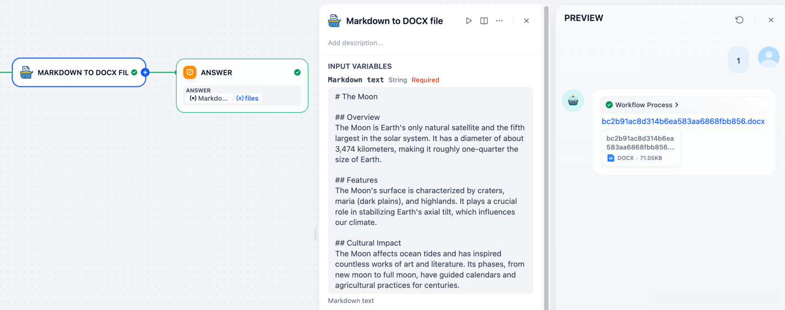


## Tools

### Markdown → DOCX

> **Custom styling: Template DOCX file**
> `md_to_docx` tool supports using an optional custom DOCX template file.
> The default template docx file used in `md_to_docx` tool could be found in [this link](https://github.com/bowenliang123/md_exporter/tree/main/tools/md_to_docx/template).
>
> In Microsoft Word, the template docx file controls the styles
> for headings, paragraphs, tables, lists, etc.
>
> Please refer to Microsoft Words's official docs at `Modify an existing style`
> section of [Customize or create new styles](https://support.microsoft.com/en-us/office/customize-or-create-new-styles-d38d6e47-f6fc-48eb-a607-1eb120dec563).
> Use Microsoft Word's "Home" - "Style Panel"
> to set the fonts, font size, color, spacing, indentation, alignment, etc.

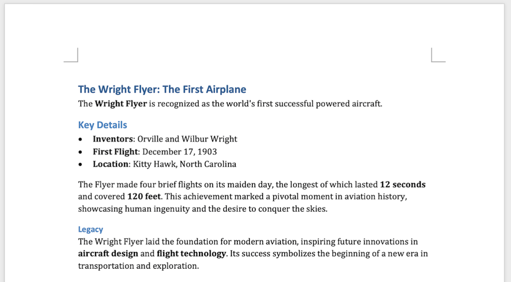

---

### Markdown → XLSX

Input Markdown text:

```
| Name    | Age | City        |
|---------|-----|-------------|
| Alice   | 30  | New York    |
| Bowen   | 25  | Guangzhou   |
| Charlie | 35  | Tokyo       |
| David   | 40  | Miami       |
```


output XLSX file:

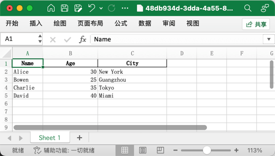

---

### Markdown → PPTX

> **Syntax**
> 
> The input Markdown text of slides **MUST** follows the syle rules of [md2pptx's  syntax](https://github.com/MartinPacker/md2pptx/blob/master/docs/user-guide.md#creating-slides).
> It supports:
> - [Title Slides](https://github.com/MartinPacker/md2pptx/blob/master/docs/user-guide.md#presentation-title-slides)
> - [Bullet Items](https://github.com/MartinPacker/md2pptx/blob/master/docs/user-guide.md#bullet-slides)
> - [Tables](https://github.com/MartinPacker/md2pptx/blob/master/docs/user-guide.md#table-slides)
> - [Hyper links and Inner links](https://github.com/MartinPacker/md2pptx/blob/master/docs/user-guide.md#hyperlinks-and-vba-macros)
> - and more, please refer to [docs](https://github.com/MartinPacker/md2pptx/blob/master/docs/user-guide.md).

> **Custom styling by Template PPTX file: Slide Master**
> `md_to_pptx` tool supports using an optional custom PPTX template file with slide master.
> The default template pptx file used in `md_to_pptx` tool could be found in [this link](https://github.com/bowenliang123/md_exporter/tree/main/tools/md_to_pptx/template).
>
> In Microsoft PowerPoint, a slide master controls the overall design and layout of the slides in a presentation,
> eg. font size on title, color style for text, layouts.
>
> If you are looking for a way to customize the appearance of your slides, you can create a template PPTX file with slide master.
> 
> To update the slide master of template pptx file, please refer to Microsoft's official docs at [Customize a slide master](https://support.microsoft.com/en-us/office/customize-a-slide-master-036d317b-3251-4237-8ddc-22f4668e2b56).

As with the input Markdown text in [md2pptx](https://github.com/MartinPacker/md2pptx/blob/master/docs/user-guide.md#creating-slides) sytle below:
```
# Markdown Exporter

### Slide 1 Title
* One
    * One A
    * One B
* Two
    * Two X
    * Two Y

### Slide 2 Title
|Left Heading|Centre Heading|Right Heading|
|:---|:-:|--:|
|Alpha|Bravo|1|
|Charlie|Delta|2|

```


The output PPTX file:

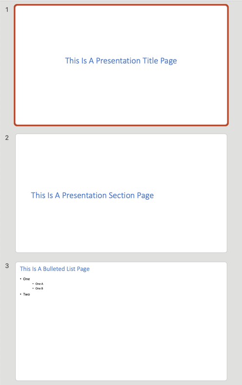

---

### Markdown → HTML


---

### Markdown → PDF

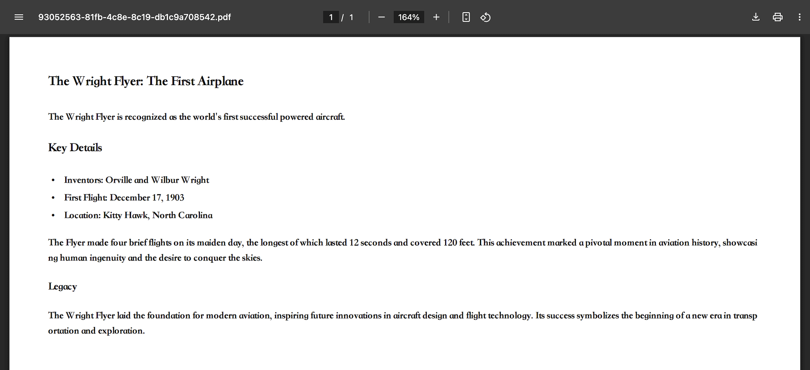

---

### Markdown → PNG


---

### Markdown → Code Blocks files (.py/.sh/.html/.css, etc.)

  Multiple generated files in formats by language type of the extracted code blocks:
  <ul>
      <li>python → .py file</li>
      <li>javascript → .js file</li>
      <li>html → .html file</li>
      <li>bash → .sh file</li>
      <li>json → .json file</li>
      <li>xml → .xml file</li>
      <li>svg → .svg file</li>
      <li>css → .css file</li>
      <li>yaml → .yaml file</li>
      <li>ruby → .rb file</li>
      <li>java → .java file</li>
      <li>php → .php file</li>
      <li>markdown → .md file</li>
  </ul>

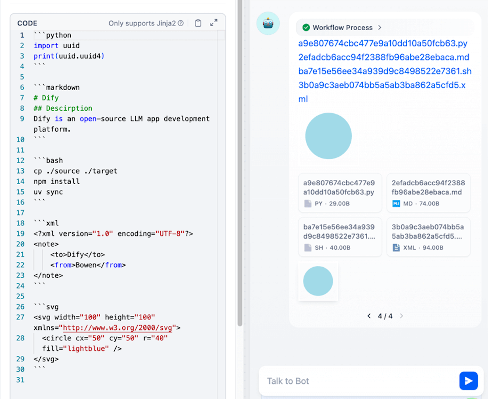

If compression is enabled, all the code blocks will be generated into a single ZIP file.
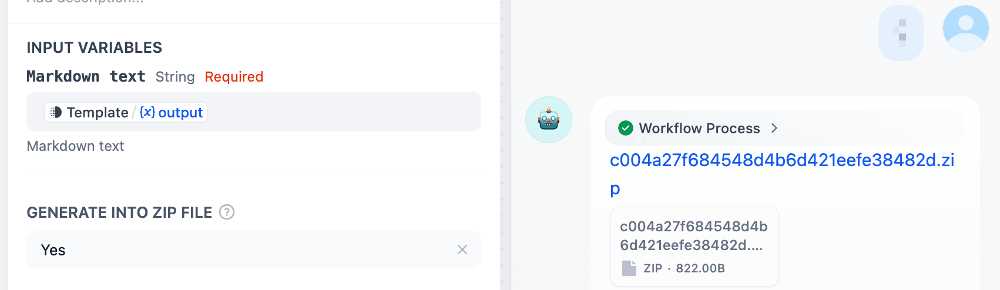
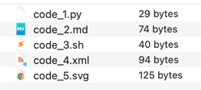

---

### Markdown → Linked Image files

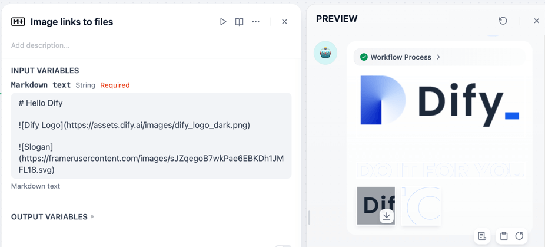

---

### Markdown → RST (reStructedText)

Converted .rst file by using mistune's RST render with basic reStructedText syntax support.

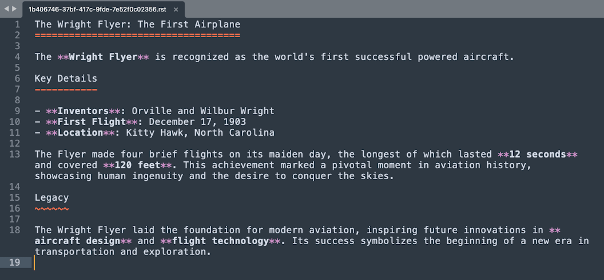

---

### Markdown → CSV


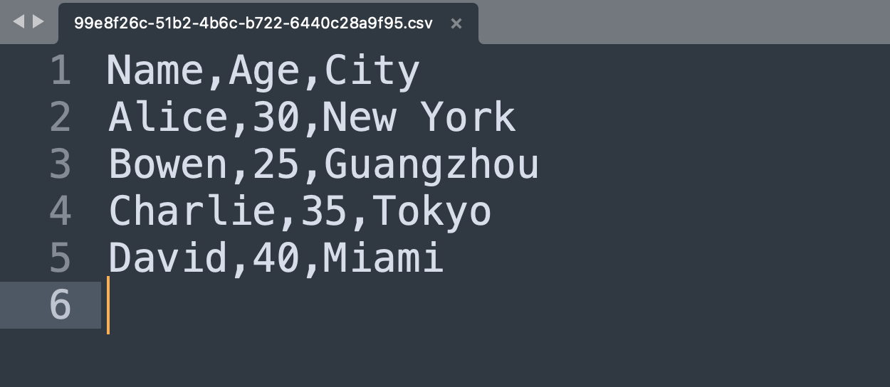


---

### Markdown → JSON / JSONL

- JSONL style (default output style)
  - one object per line
   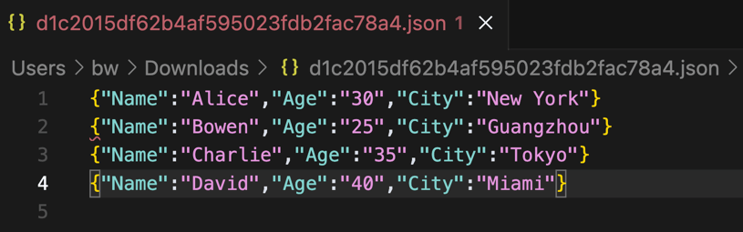

- JSON Array style
  - all objects in a single array
  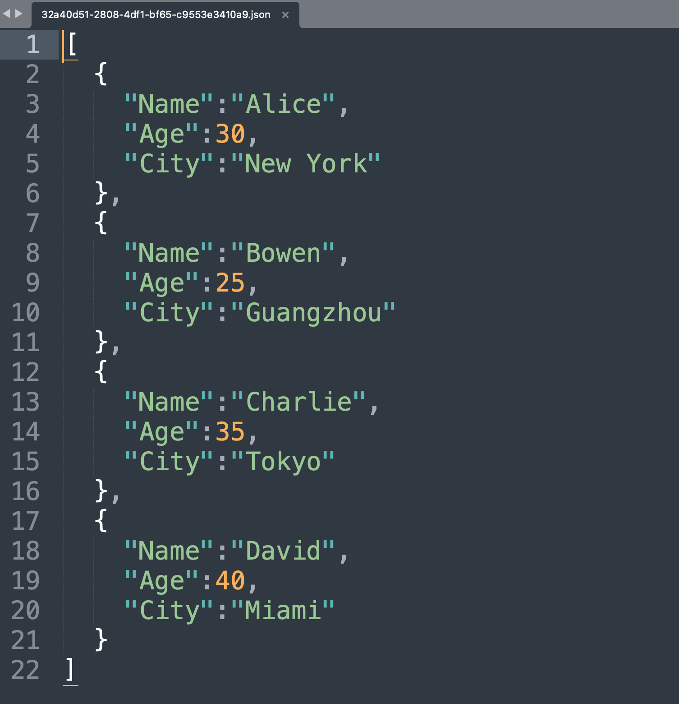

---

### Markdown → XML

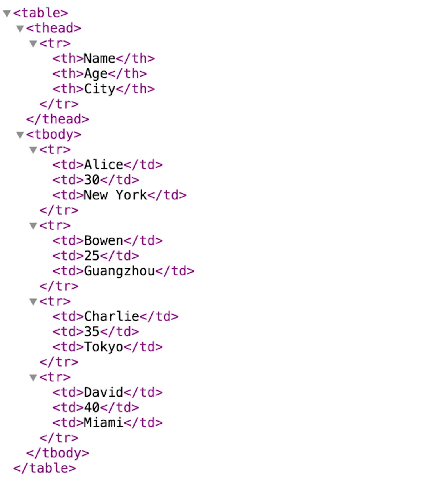

---

### Markdown → LaTeX

output LaTeX file:

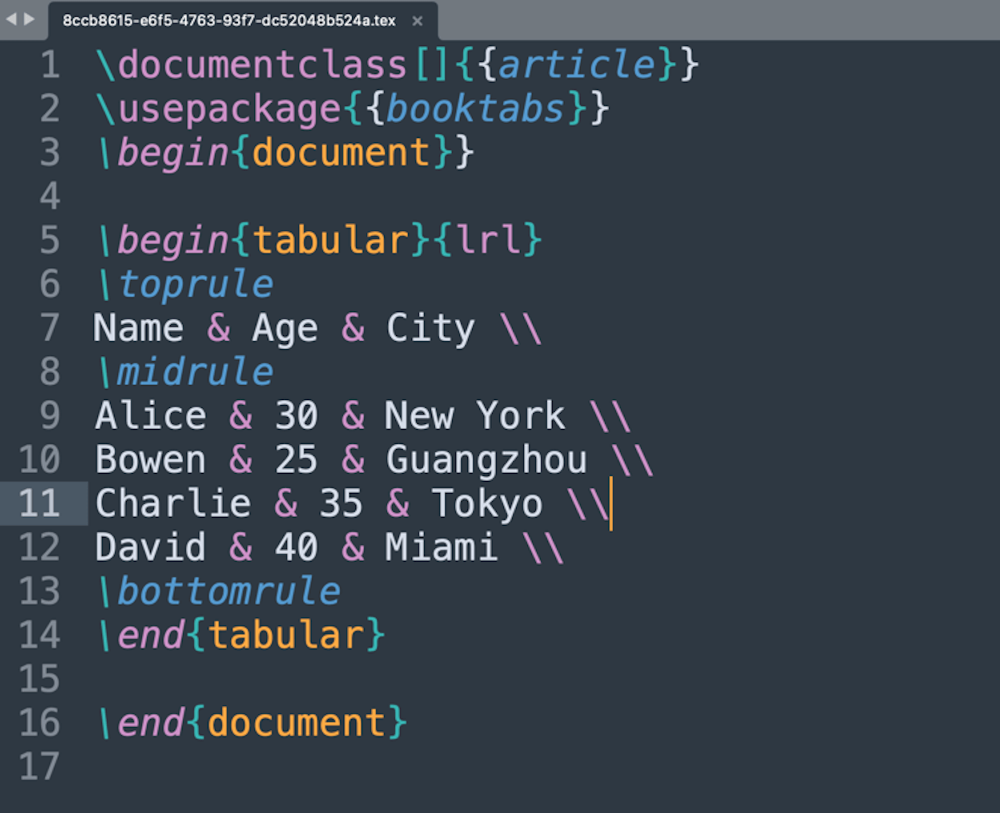

viewed as PDF:

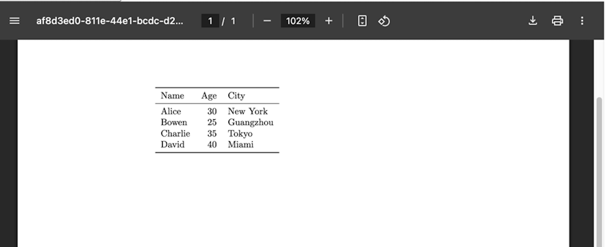

---

### Markdown → Markdown

Output `.md` file with original input Markdown text.


---

## Changelog
- 2.0.0:
  - [ BREAKING CHANGE ] migrate `md_to_docx` tool to use `pandoc` for conversion 
  - Major improvements in `md_to_docx` tool
    - support custom styling by using a template DOCX file, setting the fonts, font size, color style for headings, paragraphs, etc.
    - optimized file size in generated docx file
    - better support for multi-language content
  - remove `md_to_rst` and `md_to_epub` tools
  - add `force_text_value` option in md_to_xlsx tool to control whether to force convert all cell values to text string

- 1.12.0:
  - fix input pptx template file optional in `md_to_pptx` tool
  - fix error message with file path in cmd assembly in `md_to_pptx` tool
  - bump `md2pptx` to 6.0

- 1.10.2:
  - bump `md2pptx` from 5.4.4 to 5.4.5
  - bump `python-docx` from 1.1 to 1.2.0
  - increase PDF generation capacity limit to 500MB

- 1.10.0:
  - Support output JSONL style in `md_to_json` tool, as JSON Lines format with one object per line
  - Change the default output style of `md_to_json` tool to JSONL
  - Minor doc updates in parameter description

- 1.9.0:
  - Support custom sheet name in `md_to_xlsx` tool by using headings in Markdown text
  - Force convert column type to string in `md_to_xlsx` tool to prevent data precision loss and display issues in Microsoft Excel
  - Autofit column width in `md_to_xlsx` tool

- 1.8.0:
  - Solve issues with garbled characters when opening CSV files containing non-ASCII characters (eg. Chinese or Japanese characters, Emoji characters etc.) in Microsoft Excel

- 1.7.0:
  - Support custom PPTX template file in `md_to_pptx` tool
  - Support file generation from multiple tables in md_to_csv, md_to_latex, md_to_xlsx tools

- 1.6.0:
  - Introducing `md_to_html_text` tool, support converting Markdown text to HTML text
  - Standardize fonts for headings and body paragraphs DOCX file generated by `md_to_docx` tool

- 1.5.0:
  - Improve PDF display for pure English markdown text input in `md_to_pdf` tool, by skipping the font setting for CJK characters
  - Introduce `md_to_epub` tool, support converting Markdown text to EPUB eBook files
  - Support compressing all png files in single zip file in `md_to_png` tool
  - Increase capacity limit for PDF file to 100MB in `md_to_pdf` tool
  - Remove explicit timeout config MAX_REQUEST_TIMEOUT

- 1.4.100:
  - Special version for celebrating [Dify](https://github.com/langgenius/dify)'s 100k GitHub stars milestone
  - add `md_to_png` tool, support converting Markdown text to PNG image files

- 1.3.0:
  - update SDK version  

- 1.2.0:
  - Support compressing images to single zip file in `md_to_linked_image` tool

- 1.1.0:
  - Enable line breaks normalization in all tools by default, replacing all the occurrences of `\\n` to `\n`
  - Remove `<think>` tags of reasoning content in the input Markdown text
  - Fix missing custom output filename support in md_to_csv, md_to_json, md_to_latex tool

- 1.0.1:
  - Remove redundant URL safe conversion in custom output filename

- 1.0.0:
  - Support customize the output file name

- 0.5.0:
  - Introducing `md_to_linked_image` tool, support extracting image files in links in Markdown text

- 0.4.3:
  - improve the display of Chinese characters in text paragraph in `md_to_docx` tool, by setting global font to Song if content contains Chinese     - improve the display of Chinese characters in text paragraph in `md_to_docx` tool, by setting global font to Song if content contains Chinese charactor

- 0.4.2:
  - support Java, PHP and Ruby file exporting in `md_to_codeblocks` tool

- 0.4.1:
  - support YAML file exporting in `md_to_codeblocks` tool

- 0.4.0:
  - support exporting Markdown codeblocks in to single zip file in `md_to_codeblocks` tool

- 0.3.0:
  - Fixed the error in importing libraries of `md_to_pptx` tool when running on self-hosted Dify plugin-daemon service

- 0.2.0:
  - Introducing `md_to_codeblock` tool, support extracting code blocks in Markdown to Python, JSON, JS, BASH, SVG, HTML, XML, MARKDOWN files. 
  - Introducing `md_to_rst` tool, support reStructuredText `.rst` file format as destination file format

- 0.1.x:
  - Introducing `md_to_pptx` tool, support PowerPoint `.pptx` file format as destination file format

- 0.0.x:
  - Published to Dify Marketplace
  - support exporting Markdown to DOCX, PPTX, XLSX, PDF, HTML, MD, CSV, JSON, XML, LaTex files

## Used Open sourced projects

This Dify plugin uses the following open sourced projects:

- [md2pptx](https://github.com/MartinPacker/md2pptx) , MIT License
- [pypandoc](https://github.com/JessicaTegner/pypandoc), MIT License
- [pandas](https://github.com/pandas-dev/pandas), BSD 3-Clause License
- [python-pptx](https://github.com/scanny/python-pptx), MIT License
- [xhtml2pdf](https://github.com/xhtml2pdf/xhtml2pdf), Apache License 2.0

## License
- Apache License 2.0


## Privacy

This plugin collects no data.

All the file transformations are completed locally. NO data is transmitted to third-party services.
