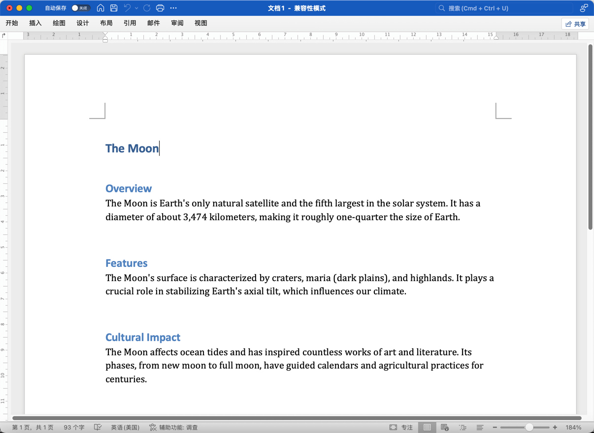
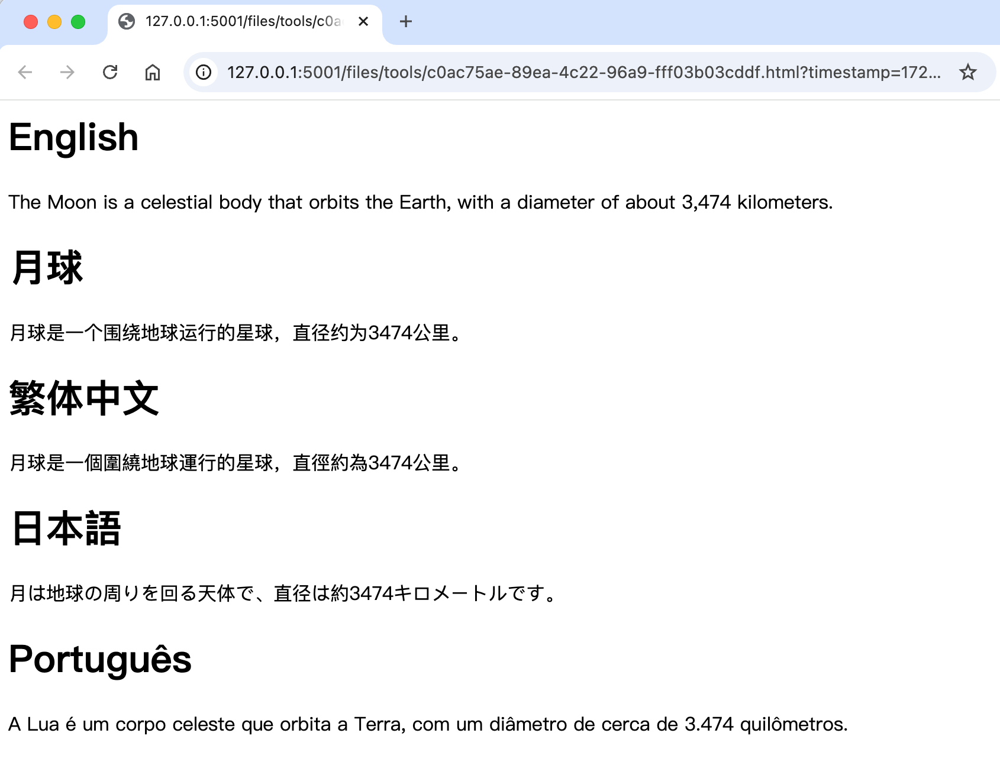
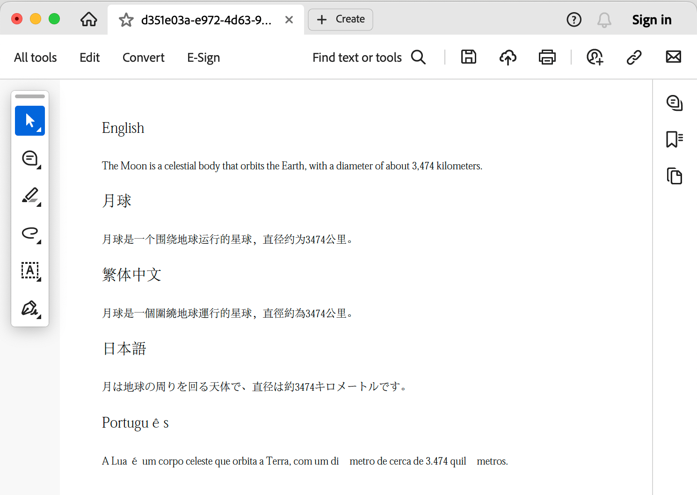
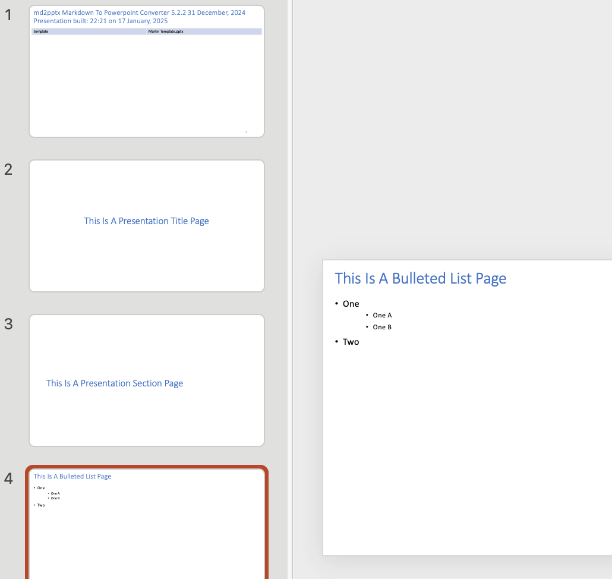
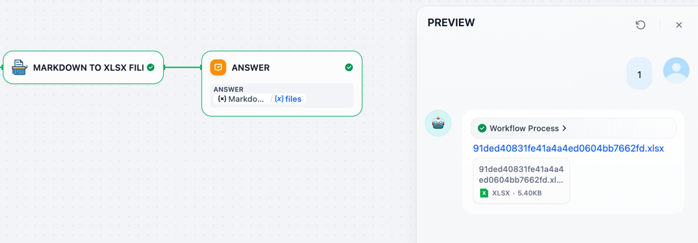
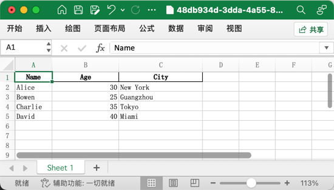

## Markdown Exporter

**Author:** [bowenliang123](https://github.com/bowenliang123)

### Description

This plugins provides tools to export markdown text to Docx/Xlsx/Pptx/PDF/HTML/md files.

| Tool         | Purpose                           | Input                     | Output        |
|--------------|-----------------------------------|---------------------------|---------------|
| `md_to_docx` | Convert Markdown to DOCX          | Markdown text             | DOCX file     |
| `md_to_html` | Convert Markdown to HTML          | Markdown text             | HTML file     |
| `md_to_md`   | Convert Markdown to Markdown file | Markdown text             | Markdown file |
| `md_to_pdf`  | Convert Markdown to PDF           | Markdown text             | PDF file      |
| `md_to_pptx` | Convert Markdown to PPTX          | Markdown text             | PPTX file     |
| `md_to_xlsx` | Convert Markdown to XLSX          | Tables in Markdown syntax | XLSX file     |

- `md_to_docx` Tool

  input markdown text:

```
# English
The Moon is a celestial body that orbits the Earth, with a diameter of about 3,474 kilometers.

# 月球
月球是一个围绕地球运行的星球，直径约为3474公里。

# 繁体中文
月球是一個圍繞地球運行的星球，直徑約為3474公里。

# 日本語
月は地球の周りを回る天体で、直径は約3474キロメートルです。

# Português
A Lua é um corpo celeste que orbita a Terra, com um diâmetro de cerca de 3.474 quilômetros.
```

usage:


output DOCX file:


- `md_to_html` Tool

output HTML file:


- `md_to_md` Tool

- `md_to_pdf` Tool

- output PDF file:
  

- `md_to_pptx` Tool
  input markdown text:

```markdown
# This Is A Presentation Title Page

## This Is A Presentation Section Page

### This Is A Bulleted List Page

* One
    * One A
    * One B
* Two
```

output PPTX file:


- `md_to_xlsx` Tool

input markdown text:

```
| Name    | Age | City        |
|---------|-----|-------------|
| Alice   | 30  | New York    |
| Bowen   | 25  | Guangzhou   |
| Charlie | 35  | Tokyo       |
| David   | 40  | Miami       |
```

usage:



output XLSX file:



### Open Source Project declaration

- md2pptx
    - repo: https://github.com/MartinPacker/md2pptx
    - licence: MIT licence

